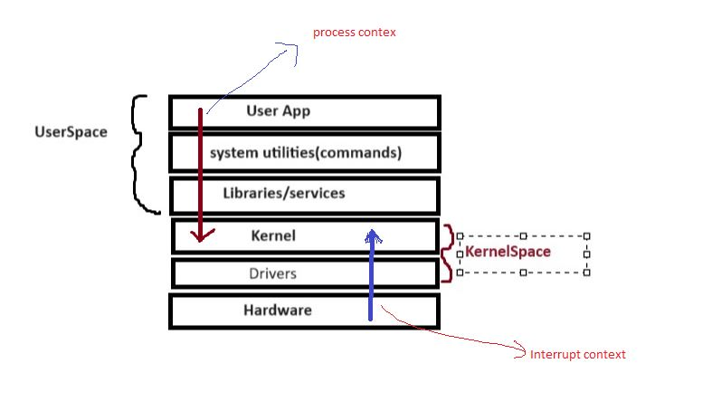
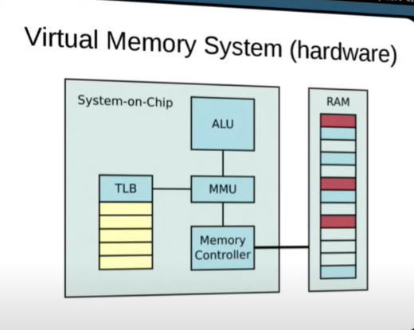

# Main Linux topics to be studied each:

---
## Linux Kernel Overview
### Linux Subsystem Diagram

---
### Role of the kernel

- [ ] **Process Management:** The kernel is responsible for creating and managing processes. It handles scheduling, allowing multiple processes to run concurrently, and manages process priorities to efficiently use the CPU. It also takes care of process termination, inter-process communication (IPC), and synchronization.

- [ ] **Memory Management:** The kernel controls how memory is allocated and used by processes and the kernel itself. It manages memory access permissions, virtual memory, paging, and swapping to ensure that each process has access to the memory it needs without interfering with other processes.

- [ ] Device Drivers:** The kernel includes drivers for a wide range of hardware devices, enabling the operating system to interact with hardware such as disk drives, graphics cards, network interfaces, and peripheral devices. It abstracts the hardware specifics into a uniform interface for software applications.

- [ ] **File Systems:** It provides a file system infrastructure that allows for data storage, access, and management. The kernel supports multiple file systems, enabling it to work with various storage devices and protocols. It handles operations like reading, writing, creating, and deleting files and directories.

- [ ] **Networking:** The kernel handles the networking stack, allowing the system to communicate over local networks and the internet. It implements protocols for data transmission, routing, and network configuration, enabling both wired and wireless networking capabilities.

- [ ] **Security and Access Control:** The kernel enforces security policies that control how processes and users can access system resources. It includes mechanisms for user authentication, permission checks, and secure communication between processes.

- [ ] **System Calls and Kernel APIs:** Through system calls, the kernel provides a programming interface that allows user-space applications to request and use kernel services. This includes operations related to process management, file operations, and communication.

- [ ] **Hardware Abstraction:** By providing a consistent programming interface, the kernel abstracts away the complexity of hardware differences. This allows software developers to write applications without needing to tailor their programs to specific hardware configurations.

The Linux kernel's architecture and design principles, such as modularity and the ability to load kernel modules at runtime, allow for a flexible and customizable operating system. This adaptability makes Linux suitable for a wide range of applications, from embedded systems and mobile devices to powerful servers and desktop systems.

### Code Contexts

- [ ] **Modularity:** The kernel is modular, meaning parts of it can be loaded or unloaded at runtime. This modularity is seen in the use of kernel modules, which can be inserted into the running kernel to add functionality (like device drivers or file system types) without needing to reboot.

- [ ] **Portability:** The Linux kernel can run on various hardware architectures, including x86, ARM, and MIPS. This is achieved through a careful separation of architecture-specific code from the generic kernel code, allowing for easier porting to different hardware.

- [ ] **Concurrency:** Given the multitasking nature of operating systems, the Linux kernel is designed to handle multiple processes concurrently. This involves sophisticated scheduling algorithms, synchronization mechanisms, and concurrency control to manage access to resources.

- [ ] **Security and Isolation:** The kernel enforces security through mechanisms like process isolation, user permissions, and various security modules (e.g., SELinux, AppArmor). These ensure that applications and users can only access resources they are permitted to, enhancing system security.

- [ ] **System Calls Interface:** The interface between user space and kernel space is defined by system calls. The kernel provides a set of system calls through which user-space applications request kernel services. This includes operations like opening files, sending network packets, or creating new processes.

- [ ] **Networking Stack:** The Linux kernel includes a robust networking stack that implements various network protocols (TCP/IP, UDP, etc.), enabling it to handle complex networking tasks and support various types of network interfaces.

- [ ] **File Systems Support:** Linux supports a wide range of file systems, from its native Ext4 to NTFS, NFS, and more. This is facilitated by a virtual file system (VFS) layer that provides a common interface to different file systems, simplifying file operations.

- [ ] **Understanding the Linux Kernel Code:**
Source Organization: The kernel source is organized into directories by functionality, such as /kernel for core kernel components, /drivers for device drivers, /fs for file systems, and /net for networking.

### System Call Interface

The System Call Interface (SCI) in operating systems, particularly in Unix-like systems such as Linux, serves as a critical boundary between user space and kernel space. It provides a set of standardized programming interfaces through which user-space applications can request services from the operating system kernel. These services include operations related to file management, process control, communication, and memory management, among others.

- [ ] **Key Aspects of the System Call Interface:**
- [ ] **Abstraction: The SCI abstracts the complexity of hardware and kernel operations from user-space applications, offering a simpler and more stable API for programmers. This abstraction allows applications to perform complex tasks without needing to know the intricate details of hardware operations or kernel internals.

- [ ] **Security and Stability:** By mediating access to hardware and critical system resources, the system call interface helps maintain system security and stability. It ensures that applications run in user mode cannot directly access hardware or kernel memory, protecting the system from accidental or malicious damage.

- [ ] **Consistency Across Platforms:** The system call interface provides a consistent API that applications can use, regardless of underlying hardware differences. This consistency is crucial for the portability of software across different systems and architectures.

- [ ] **How System Calls Work:**
- [ ] Invocation:** When a user-space application needs to perform an operation that requires kernel services (such as reading a file), it invokes a system call.

- [ ] **Context Switch:** Invoking a system call triggers a context switch from user mode to kernel mode. This switch is typically facilitated by a software interrupt or a specific CPU instruction designed to transition control to the kernel.

- [ ] **Execution:** Once in kernel mode, the kernel examines the system call number (which identifies the requested service) and its parameters passed by the application. The kernel then executes the corresponding system function.

- [ ] **Return:** After executing the system call, the kernel returns the result to the user-space application, reverting the CPU to user mode. This return may include data requested by the application, status information, or error codes.

- [ ] **Examples of Common System Calls:**
read() and write(): Read from and write to file descriptors.
fork(): Create a new process.
exec(): Execute a new program in the current process space.
wait(): Wait for a process to change state.
open() and close(): Open and close a file descriptor.
mmap(): Map files or devices into memory.
ioctl(): Perform device-specific input/output operations.
- [ ] **Interface and Implementation:**
The actual implementation of system calls can vary between different operating systems, but the concept and purpose remain consistent: to safely and efficiently provide applications with the ability to perform operations that are beyond their direct control. In Linux, the system call interface is well-documented, and developers can use a range of system calls defined in headers found within the standard C library (libc) and other libraries.

Understanding the system call interface is crucial for systems programming, as it directly impacts how applications interact with the operating system and, ultimately, with the hardware itself

### Process data structures

The relationship between processes and data structures in computer science is foundational, with each concept playing a crucial role in how computers operate, manage tasks, and organize information. Let's explore these concepts separately and then see how they interrelate.

**Process**
A process is an instance of a computer program that is being executed. It contains the program code and its current activity. Each process has a process control block (PCB), which contains important information about the process, such as its process state, process ID, process priority, CPU registers, CPU scheduling information, memory management information, and accounting information. The operating system uses processes to manage tasks and ensure that each task receives enough resources to function properly, as well as isolating the tasks to prevent them from interfering with each other.

**Data Structure**
A data structure is a particular way of organizing and storing data in a computer so that it can be accessed and modified efficiently. Examples of data structures include arrays, linked lists, stacks, queues, trees, graphs, and hash tables. Each of these structures has its own strengths and weaknesses in terms of access time, storage requirements, and the complexity of implementing various operations such as insertion, deletion, and traversal.

**Processes and Data Structures:** How They Relate
In the context of operating systems and their management of processes, data structures are used extensively to organize and manage information about processes. Here's how:

**Process Control Blocks (PCBs):** Each process is represented by a PCB, a data structure that contains information about the process's state, its context (such as CPU register values), scheduling information, memory management information, and more. The PCB is essential for the operating system to switch between processes efficiently (context switching).

**Scheduling Queues:** The operating system uses various types of queues, which are data structures, to manage process scheduling. There are ready queues for processes that are ready to run, wait queues for processes waiting for an event or I/O operation to complete, and others. These queues help the operating system scheduler decide which process to run next.

**Lists, Trees, and Hash Tables:** These data structures can be used to manage resources and keep track of information such as open file tables, memory allocation tables, and more. For example, a binary tree might be used to manage the hierarchy of file systems, or hash tables could be used to quickly look up process attributes.

**Inter-process Communication (IPC):** Data structures play a role in IPC mechanisms as well. For example, buffers, pipes, and message queues are data structures that facilitate the exchange of data between processes.

**Memory Management:** Data structures like stacks and heaps are used within processes for dynamic memory allocation. The operating system itself uses data structures to track memory usage, such as page tables for virtual memory management.

In essence, data structures provide the necessary framework for organizing, managing, and storing the information processes need to run efficiently. They are the backbone of process management within operating systems, enabling complex computations to be performed in an organized, efficient manner.

- The /proc File System
- Process creation
- User/Kernel Mode Stacks
- Linked Lists
## Loadable Kernel Modules
- What are they
- Module related commands
- Module functions
- Printk()
- Kernel Modules and the GPL
## Debugging Kernel Code
- More on Printk()
- creating /proc files
- The sys file system
 - [ ] debugfs
- cscope
- kernel crashes —the “oops” message
- KDB and KGDB
## Synchronization
- Need for Synchronization
- [ ] critical Section
- Mutexes
- semaphores
- Completions
- A tomic Operations
- [ ] Bits
- [ ] Integers
- Spin locks
- [ ] Read-write Spinlocks
- Alternative to Blocking

- [ ] Sequential Locks
- [ ] Read-Copy-Update
- [ ] Per-CPU Variables
## Memory Management
### Virtual Memory

virtual memory is an important concept in linux kernel. virtual memory addresses are mapped to the physical RAM and also mapped to other hardware devices PCI GPU and so on
Virtual memory is used on software side and give separate spaces for each process indepandtly. MMU has a role in implementing virtual memory

- Paging
- kmalloc() and friends
- Slab Allocator
- get_free_page() and friends
- Buddy Algorithm
## Device Drivers
- What is a Device Driver?
- The /dev directory
- Device Registration
- [ ] The File Operations Table
- Unified Device Model
 

## Interrupt Context
- interrupt handlers
- [ ] Registering an Interrupt Handler
- Deferred work

- [ ] Tasklets
- [ ] Workqueues
- Timers
## Virtual Filesystem/Block Devices
- VFS data structures
- Adding a filesystem
- The Block Layer
- [ ] I/O Schedulers
- Block devices
## Configuring and Building the Kernel
- Why build the kernel?
- Where to get the Kernel
- [ ] Upstream and Downstream Kernels
- Kernel Source Tree
- Configuring the Kernel
- Building and Installing the Kernel
## The Scheduler
- What does the Scheduler Do?
- Completely Fair Scheduler
- [ ] Red/Black Trees
- High Resolution Timer
## The Linux Boot Process
- BIOS
- Bootloader
- [ ] Grub
- Initial RAM Disk
- Kernel Initialization
- init process
- Run Levels
