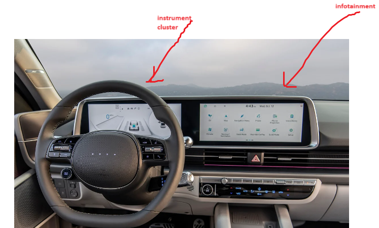

# These are daily topics to be explored every weekend

## 1. Instrument Cluster
In the automotive industry, the term "cluster" most commonly refers to the instrument cluster. This is the display area located on a car's dashboard directly in front of the driver, which contains the collection of instruments and indicators that provide crucial information about the car's status. Here's what it typically includes:  

**Speedometer:** Displays vehicle speed.  
**Tachometer:** Shows engine RPM.  
**Fuel Gauge:** Indicates fuel level.  
**Temperature Gauge:** Monitors engine coolant temperature.  
**Odometer:** Tracks total distance traveled by the vehicle.  
**Trip Computer:** Provides trip information like distance, fuel consumption.  
**Warning Lights/Indicators:** Alert the driver to various issues or active systems.    
  

---
## 2. Infotainment System  
**Central Display:** Touchscreen for navigation, media, and settings.  
**Audio System:** Radio, music streaming, USB or Bluetooth connectivity.  
**Vehicle Settings:** Allows adjustment of vehicle functions and personalization.  

## 3. Advanced Driver Assistance Systems (ADAS)  
**Cameras:** For parking assistance, surround-view.  
**Sensors:** Radar, ultrasonic, and LiDAR for adaptive cruise control, blind-spot detection, and collision avoidance.  
**Control Units:** Process sensor data to assist or automate certain driving functions.  

## 4. Engine Control Unit (ECU)  
**Engine Management:** Controls fuel injection, ignition timing, and emissions.  
**Diagnostics:** Provides error codes for troubleshooting (OBD-II system).  

## 5. Body Control Module (BCM)  
**Lighting:** Manages exterior and interior lighting.  
**Comfort Features:** Controls power windows, seats, and mirrors.  
**Security:** Vehicle anti-theft systems and central locking.  

## 6. Transmission Control Unit (TCU)  
**Gear Selection:** Manages automatic gear shifting.  
**Transmission Health:** Monitors transmission performance and fluid levels.  

## 7. Safety Systems  
**Airbags:** Deployment control and readiness status.  
**Seatbelts:** Pre-tensioner control and fastening detection.  

## 8. Climate Control  
**HVAC:** Regulates heating, ventilation, and air conditioning settings.  
**Air Quality:** Monitors and filters cabin air.  

## 9. Powertrain and Chassis Electronics  
**Stability Control:** Manages electronic stability control systems.  
**Braking System:** Anti-lock braking system (ABS) and electronic brakeforce distribution (EBD).  

## 10. Electric and Hybrid Systems  
**Battery Management:** Monitors health and charge level of hybrid/electric batteries.  
**Electric Motor Control:** Manages power delivery from electric motors.  

## 11. Connectivity  
**Telematics:** Systems for GPS tracking, emergency services, and remote diagnostics.  
**Wireless Modules:** Bluetooth, Wi-Fi, and cellular connections for in-car connectivity.  

## GOOD BOOKS FOR READING:
The following resources have further information on the topics introduced in this chapter:  
- Linux Kernel Development, 3rd Edition, by Robert Love  
- Linux System Programming, 2nd Edition, by Robert Love  
- Understanding the Linux VM Manager by Mel Gorman: https://www.kernel.  
org/doc/gorman/pdf/understand.pdf  
- Valgrind 3.3 - Advanced Debugging and Profiling for Gnu/Linux Applications by J Seward, N. Nethercote, and J. Weidendorfer   

---
## deadlock vs race condition   
when two processes access the same resource at once the resulting output is always wrong and this is called **race codition** and to avoid race condition we use locking mechanism which serializes the access in a way one after other or synchronizes the execution but some time it leads to **deadlock** and it is a condition in which two processes waiting/spinning for each other to release the lock and acquire that lock 

- spinlock and semaphore and daemons etc
- step through linux kernel source (there is some way to run linux kernel in userspace as other program and understand the flow)
- vehicle ignition, starting, electronic system working when not working all these concepts should be cleared
- memory sections .text .data .bss etc RAM/FLASH (for this the ucour from kirls is the best)
- ftrace
- strace
- corefile
- KVM
- XEN hypervisor and its interaction with kernel
- clamps
- vfs
- virtual memory
- call trace, call stack
- phony target in Makefile
