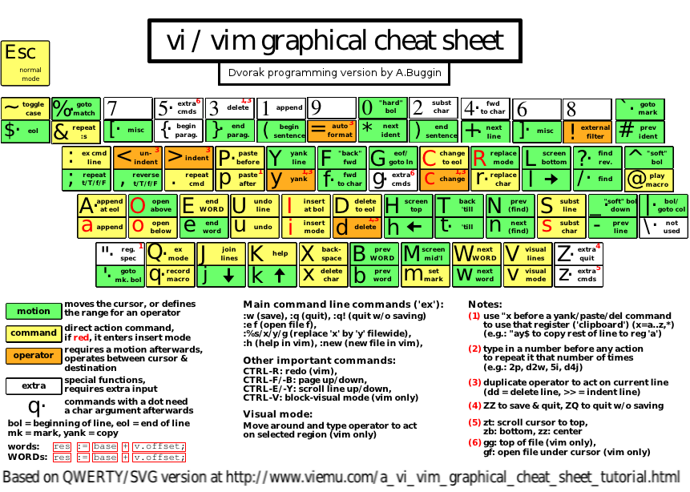

In mark down there total three types of different headings as shown below with varying number of hashes (#)
# Heading 1
## Heading 2
### Heading 3


# Test Paragraph
you can write a paragraph after heading 

the below three dashes produce horizontal line


---

to make any texst bold just use double aestriks on both sides as shown below

**KHAN**

to make the text italic use single aestrik on both sides such as

*KHAN*

>To write blockquote put an angle bracket in start

to numbering in start of line write as 

1. first line 
2. second line

if you want to put dot sign in the start of line just put - in start

- first line 
- second line
- third line

if you want to put a checkbox in start 

- [x] line 1
- [x] line 2
- [x] line 3

for uncheckbox put space in the square bracket instead x

- [ ] line 1
- [ ] line 2
- [ ] line 3

To Write code just put two tilt and write the code within these tilt ``

`#include <stido.h>`

or you cat put three and then specify the language and then  write the code as much as you wish

```c
#include <stdio.h>

int main(){
	printf("Test code for showing in markdown preview!");
return 0;
}

```

To insert the link write square bracket and round bracket : specify the title in [] and link in round bracket
[title](link) such as shown below

[git](https://github.com/malkootkhan/MyImportantNotes/blob/master/markDownGuide.md)


in same way to display picture 
 such as shown




